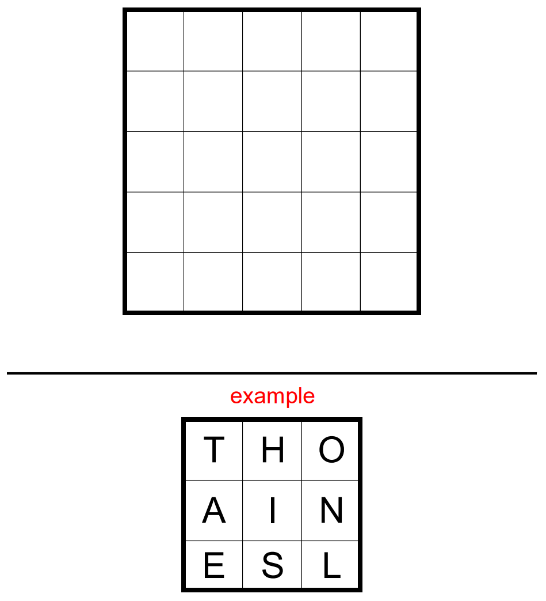

# Altered States 2 #

## Jane Street Puzzle solved by Joe Buckley ##

Please go to the June 2024 entry in Jane Street's [Puzzle Archive](https://www.janestreet.com/puzzles/archive/ "archive") for the official prompt and other months' puzzles.

### Solved by Joe Buckley ###

## Instructions ##

A little while ago we asked solvers to smoosh as many of the 50 U.S. states into a 5-by-5 grid as possible.

Now we’re at it again! Once more, your goal is to score **as many points as possible** by placing **U.S. states** in a 5-by-5 grid.

*   States can be spelled by making **King’s moves** from square to square. (See the example.)
*   This time around, the score for a state is its **population** in the [2020 U.S. Census](https://en.wikipedia.org/wiki/2020_United_States_census#State_rankings "census"). So, for example, CALIFORNIA scores 39,538,223 points.
*   In the true spirit of the puzzle’s title, you may “alter” the name of a state by _at most one letter_. “Altering” a state means replacing a letter with another letter. (So NEW**P**ORK, NEWYOR**F**, and NEWYORK would all score for NEWYORK, but NEWYRK and NEWY**RO**K would not.)
*   If a state appears multiple times in your grid, it only scores once.

The 3-by-3 example above scores **32,913,047 points**, for Illinois (Inlinois), Ohio, Utah (Atah), Iowa (Ioha), and Idaho (Ieaho).

To send in your entry, please render your grid as **one unbroken 25-digit string** by concatenating the rows. (The 3-by-3 grid from the example would be “thoainesl”.)

To qualify for the leaderboard, you entry must score **at least half** of the available points. (So: at least 165,379,868.)

## Solution ##

We need to find an optimal 5x5 arrangement of letters to maximize our score. Since we don't have any training data and can't easily generate any, we'll have to be smarter than just throwing data at a neural net until it spits out the right answer. Instead, we'll have to use an iterative optimization technique to generate, test, and improve our arrangement of letters. This sounds like the perfect job for a **genetic algorithm**. 

The genetic algorithm is inspired by natural selection in the biological world, in which each generation of solutions is iteratively improved via recombination and mutation until an acceptable solution is found. In other words, first we randomly generate solutions. Then, we take pairs of those solutions, split each one in half, and recombine each of the different halves so we have two new child candidates. Next, in the mutation step we inject noise into the process by regenerating one or more of the letters in a candidate solution so as to broaden the set of paths that we search. Now it's time to score each new solution using the evaluation function that we want to maximaize. Finally, using the parent and child population of solutions, we select the top 50% of candidates, thus keeping the same number of potential solutions. Each iteration we will have a top-scoring candidate, and once we breach our threshold of 165 million, we're done!

After a few hours of running the code, our best string was 

> WTIMA
> ENSVF
> KOALI
> RCSRO
> ENAIN

giving us a score of 188,652,076.